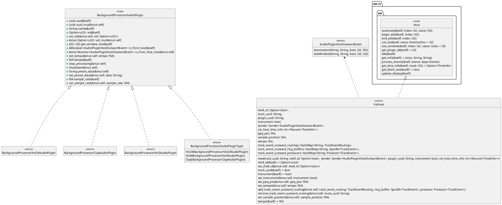
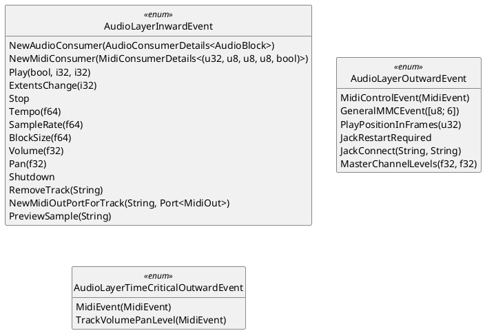

## Plugins

```plantuml
@startuml
hide circle 

class BackgroundProcessorAudioPlugin <<trait>> {
    +Uuid uuid(&self)
    +Uuid uuid_mut(&mut self)
    +String name(&self)
    +Option<u32> xid(&self)
    +set_xid(&mut self, xid: Option<u32>)
    +&mut Option<u32> xid_mut(&mut self)
    +(i32, i32) get_window_size(&self)
    +&Receiver<AudioPluginHostOutwardEvent> rx_from_host(&self)
    +&mut Receiver<AudioPluginHostOutwardEvent> rx_from_host_mut(&mut self)
    +set_tempo(&mut self, tempo: f64)
    +f64 tempo(&self)
    +stop_processing(&mut self)
    +shutdown(&mut self)
    +String preset_data(&mut self)
    +set_preset_data(&mut self, data: String)
    +f64 sample_rate(&self)
    +set_sample_rate(&mut self, sample_rate: f64)
}
hide BackgroundProcessorAudioPlugin attributes

class BackgroundProcessorVst24AudioPlugin <<struct>>
hide BackgroundProcessorVst24AudioPlugin attributes
hide BackgroundProcessorVst24AudioPlugin methods

class BackgroundProcessorClapAudioPlugin <<struct>>
hide BackgroundProcessorClapAudioPlugin attributes
hide BackgroundProcessorClapAudioPlugin methods

class BackgroundProcessorVst3AudioPlugin <<struct>>
hide BackgroundProcessorVst3AudioPlugin attributes
hide BackgroundProcessorVst3AudioPlugin methods

BackgroundProcessorAudioPlugin <|.. BackgroundProcessorVst24AudioPlugin
BackgroundProcessorAudioPlugin <|.. BackgroundProcessorClapAudioPlugin
BackgroundProcessorAudioPlugin <|.. BackgroundProcessorVst3AudioPlugin
BackgroundProcessorAudioPlugin <|.. BackgroundProcessorAudioPluginType

class BackgroundProcessorAudioPluginType <<enum>> {
    {field} Vst24(BackgroundProcessorVst24AudioPlugin)
    {field} Vst3(BackgroundProcessorVst3AudioPlugin)
    {field} Clap(BackgroundProcessorClapAudioPlugin)
}
hide BackgroundProcessorAudioPluginType methods

class AudioPluginHostOutwardEvent <<enum>> {
    {field} Automation(String, String, bool, i32, f32)
    {field} SizeWindow(String, String, bool, i32, i32)
}
hide AudioPluginHostOutwardEvent methods

namespace vst-rs {
namespace vst {
class Host <<trait>> {
    automate(&self, index: i32, value: f32)
    begin_edit(&self, index: i32)
    end_edit(&self, index: i32)
    can_do(&self, value: HostCanDo) -> i32
    size_window(&self, index: i32, value: isize) -> i32
    get_plugin_id(&self) -> i32
    idle(&self)
    get_info(&self) -> (isize, String, String)
    process_events(&self, events: &api::Events)
    get_time_info(&self, mask: i32) -> Option<TimeInfo>
    get_block_size(&self) -> isize
    update_display(&self)
}
hide Host attributes
}
}

class VstHost <<struct>> {
    shell_id: Option<isize>,
    track_uuid: String,
    plugin_uuid: String,
    instrument: bool,
    sender: Sender<AudioPluginHostOutwardEvent>,
    vst_host_time_info: Arc<RwLock<TimeInfo>>,
    ppq_pos: f64,
    sample_position: f64,
    tempo: f64,
    track_event_outward_routings: HashMap<String, TrackEventRouting>,
    track_event_outward_ring_buffers: HashMap<String, SpscRb<TrackEvent>>,
    track_event_outward_producers: HashMap<String, Producer<TrackEvent>>,
    new(track_uuid: String, shell_id: Option<isize>, sender: Sender<AudioPluginHostOutwardEvent>, plugin_uuid: String, instrument: bool, vst_host_time_info: Arc<RwLock<TimeInfo>>)
    shell_id(&self) -> Option<isize>
    set_shell_id(&mut self, shell_id: Option<isize>)
    track_uuid(&self) -> &str
    instrument(&self) -> bool
    set_instrument(&mut self, instrument: bool)
    set_ppq_pos(&mut self, ppq_pos: f64)
    set_tempo(&mut self, tempo: f64)
    add_track_event_outward_routing(&mut self, track_event_routing: TrackEventRouting, ring_buffer: SpscRb<TrackEvent>, producer: Producer<TrackEvent>)
    remove_track_event_outward_routing(&mut self, route_uuid: String)
    set_sample_position(&mut self, sample_position: f64)
    tempo(&self) -> f64
}
Host <|.. VstHost
AudioPluginHostOutwardEvent <.. VstHost

@enduml
```

## Audio Layer

```plantuml
@startuml
hide circle 

class AudioLayerInwardEvent <<enum>> {
    {field} NewAudioConsumer(AudioConsumerDetails<AudioBlock>)
    {field} NewMidiConsumer(MidiConsumerDetails<(u32, u8, u8, u8, bool)>)
    {field} Play(bool, i32, i32)
    {field} ExtentsChange(i32)
    Stop
    {field} Tempo(f64)
    {field} SampleRate(f64)
    {field} BlockSize(f64)
    {field} Volume(f32)
    {field} Pan(f32)
    Shutdown
    {field} RemoveTrack(String)
    {field} NewMidiOutPortForTrack(String, Port<MidiOut>)
    {field} PreviewSample(String)
}
hide AudioLayerInwardEvent methods

class AudioLayerOutwardEvent <<enum>> {
    {field} MidiControlEvent(MidiEvent)
    {field} GeneralMMCEvent([u8; 6])
    {field} PlayPositionInFrames(u32)
    JackRestartRequired
    {field} JackConnect(String, String)
    {field} MasterChannelLevels(f32, f32)
}
hide AudioLayerOutwardEvent methods

class AudioLayerTimeCriticalOutwardEvent <<enum>> {
    {field} MidiEvent(MidiEvent)
    {field} TrackVolumePanLevel(MidiEvent)
}
hide AudioLayerTimeCriticalOutwardEvent methods


@enduml
```

## Instrument Track

```plantuml
@startuml
hide circle

class TrackBackgroundProcessorInwardEvent <<enum>> {
    {field} SetSample(SampleData)
    {field} SetEvents((Vec<Vec<TrackEvent>>, Vec<Vec<PluginParameter>>), bool)
    {field} SetEventProcessorType(EventProcessorType)
    {field} GotoStart
    {field} MoveBack
    {field} Play(i32)
    {field} Stop
    {field} Loop(bool)
    {field} LoopExtents(i32, i32)
    {field} Pause
    {field} MoveForward
    {field} GotoEnd
    {field} Mute
    {field} Unmute
    {field} Kill
    {field} AddEffect(
        Arc<Mutex<HashMap<String, PluginLoader<VstHost>>>>,
        Arc<Mutex<HashMap<String, PluginLibrary>>>,
        Uuid,
        String,
    )
    {field} DeleteEffect(String)
    {field} SetEffectWindowId(String, u32)
    {field} ChangeInstrument(
        Arc<Mutex<HashMap<String, PluginLoader<VstHost>>>>,
        Arc<Mutex<HashMap<String, PluginLibrary>>>,
        Uuid,
        String,
    )
    {field} SetInstrumentWindowId(u32)
    {field} SetInstrumentParameter(i32, f32)
    {field} SetPresetData(String, Vec<String>)
    {field} RequestPresetData
    {field} PlayNoteImmediate(i32, i32)
    {field} StopNoteImmediate(i32, i32)
    {field} PlayControllerImmediate(i32, i32, i32)
    {field} PlayPitchBendImmediate(i32, i32, i32)
    {field} RequestInstrumentParameters
    {field} RequestEffectParameters(String)
    {field} SetBlockPosition(i32)
    {field} Volume(f32)
    {field} Pan(f32)
    {field} Tempo(f64)
    {field} AddTrackEventSendRouting(TrackEventRouting, SpscRb<TrackEvent>, Producer<TrackEvent>)
    {field} RemoveTrackEventSendRouting(String)
    {field} UpdateTrackEventSendRouting(String, TrackEventRouting)
    {field} AddTrackEventReceiveRouting(TrackEventRouting, Consumer<TrackEvent>)
    {field} RemoveTrackEventReceiveRouting(String)
    {field} UpdateTrackEventReceiveRouting(String, TrackEventRouting)
    {field} AddAudioSendRouting(AudioRouting, (SpscRb<f32>, SpscRb<f32>), (Producer<f32>, Producer<f32>))
    {field} RemoveAudioSendRouting(String)
    {field} AddAudioReceiveRouting(AudioRouting, (Consumer<f32>, Consumer<f32>))
    {field} RemoveAudioReceiveRouting(String)
}
hide TrackBackgroundProcessorInwardEvent methods

class TrackBackgroundProcessorOutwardEvent <<enum>> {
    {field} InstrumentParameters(Vec<(i32, String, Uuid, String, String, f32, String)>)
    {field} InstrumentName(String),
    {field} EffectParameters(Vec<(String, i32, String, String, f32, String)>)
    {field} GetPresetData(String, Vec<String>),
    {field} InstrumentPluginWindowSize(String, i32, i32)
    {field} EffectPluginWindowSize(String, String, i32, i32)
    {field} Automation(String, String, bool, i32, f32)
    {field} TrackRenderAudioConsumer(AudioConsumerDetails<AudioBlock>)
    {field} ChannelLevels(String, f32, f32)
}
hide TrackBackgroundProcessorOutwardEvent methods

class TrackEventProcessor <<trait>> {
    process_events(&mut self) -> (Vec<TrackEvent>, Vec<PluginParameter>)
    track_event_blocks(&self) -> &Option<Vec<Vec<TrackEvent>>>
    set_track_event_blocks(&mut self, track_event_blocks: Option<Vec<Vec<TrackEvent>>>)
    track_event_blocks_transition_to(&self) -> &Option<Vec<Vec<TrackEvent>>>
    set_track_event_blocks_transition_to(&mut self, track_event_blocks_transition_to: Option<Vec<Vec<TrackEvent>>>)
    param_event_blocks(&self) -> &Option<Vec<Vec<PluginParameter>>>
    set_param_event_blocks(&mut self, param_event_blocks: Option<Vec<Vec<PluginParameter>>>)
    play(&self) -> &bool
    set_play(&mut self, play: bool)
    play_loop_on(&self) -> &bool
    set_play_loop_on(&mut self, play_loop_on: bool)
    block_index(&self) -> &i32
    set_block_index(&mut self, block_index: i32)
    audio_plugin_immediate_events(&self) -> &Vec<TrackEvent>
    audio_plugin_immediate_events_mut(&mut self) -> &mut Vec<TrackEvent>
    set_audio_plugin_immediate_events(&mut self, audio_plugin_immediate_events: Vec<TrackEvent>)
    play_left_block_index(&self) -> &i32
    set_play_left_block_index(&mut self, play_left_block_index: i32)
    play_right_block_index(&self) -> &i32
    set_play_right_block_index(&mut self, play_right_block_index: i32)
    playing_notes(&self) -> &Vec<i32>
    playing_notes_mut(&mut self) -> &mut Vec<i32>
    set_playing_notes(&mut self, playing_notes: Vec<i32>)
    mute(&self) -> &bool
    set_mute(&mut self, mute: bool)
}
hide TrackEventProcessor attributes

class BlockBufferTrackEventProcessor <<struct>> {
    pub track_event_blocks: Option<Vec<Vec<TrackEvent>>>,
    pub track_event_blocks_transition_to: Option<Vec<Vec<TrackEvent>>>,
    pub param_event_blocks: Option<Vec<Vec<PluginParameter>>>,
    pub audio_plugin_immediate_events: Vec<TrackEvent>,
    pub block_index: i32,
    pub play: bool,
    pub play_loop_on: bool,
    pub play_left_block_index: i32,
    pub play_right_block_index: i32,
    pub playing_notes: Vec<i32>,
    pub mute: bool,
    pub fn new() -> Self
}
TrackEventProcessor <|.. BlockBufferTrackEventProcessor

class RiffBufferTrackEventProcessor <<struct>> {
    pub track_event_blocks: Option<Vec<Vec<TrackEvent>>>,
    pub track_event_blocks_transition_to: Option<Vec<Vec<TrackEvent>>>,
    pub param_event_blocks: Option<Vec<Vec<PluginParameter>>>,
    pub audio_plugin_immediate_events: Vec<TrackEvent>,
    pub block_index: i32,
    pub play: bool,
    pub play_loop_on: bool,
    pub play_left_block_index: i32,
    pub play_right_block_index: i32,
    pub playing_notes: Vec<i32>,
    pub block_size: f64,
    pub mute: bool,
    new(block_size: f64) -> Self
    extract_events(\n\
        &mut self,\n\
        events: &mut Vec<TrackEvent>,\n\
        param_events: &mut Vec<PluginParameter>,\n\
        param_event_blocks_ref: &mut Option<Vec<Vec<PluginParameter>>>,\n\
        transition: bool,\n\
        param_block_index: i32,\n\
        riff_track_events: &Vec<TrackEvent>,\n\
        start_sample: &i32,\n\
        end_sample: &i32,\n\
        wrapped_block_sample_off_set: i32)
}
TrackEventProcessor <|.. RiffBufferTrackEventProcessor

class TrackBackgroundProcessorMode <<enum>> {
    AudioOut
    Coast
    Render
}
hide TrackBackgroundProcessorMode methods

class Track <<trait>> {
    name(&self) -> &str
    name_mut(&mut self) -> &str
    set_name(&mut self, name: String)
    mute(&self) -> bool
    set_mute(&mut self, mute: bool)
    solo(&self) -> bool
    set_solo(&mut self, solo: bool)
    colour(&self) -> (f64, f64, f64, f64)
    colour_mut(&mut self) -> (f64, f64, f64, f64)
    set_colour(&mut self, red: f64, green: f64, blue: f64, alpha: f64)
    riffs_mut(&mut self) -> &mut Vec<Riff>
    riff_refs_mut(&mut self) -> &mut Vec<RiffReference>
    riffs(&self) -> &Vec<Riff>
    riff_refs(&self) -> &Vec<RiffReference>
    automation_mut(&mut self) -> &mut Automation
    automation(&self) -> &Automation
    uuid(&self) -> Uuid
    uuid_mut(&mut self) -> &mut Uuid
    uuid_string(&mut self) -> String
    set_uuid(&mut self, uuid: Uuid)
    start_background_processing(&self, ...)
    volume(&self) -> f32
    volume_mut(&mut self) -> f32
    set_volume(&mut self, volume: f32)
    pan(&self) -> f32
    pan_mut(&mut self) -> f32
    set_pan(&mut self, pan: f32)
    midi_routings_mut(&mut self) -> &mut Vec<TrackEventRouting>
    midi_routings(&self) -> &Vec<TrackEventRouting>
    audio_routings_mut(&mut self) -> &mut Vec<AudioRouting>
    audio_routings(&self) -> &Vec<AudioRouting>
}
hide Track attributes

class AudioEffectTrack <<trait>> {
    effects(&self) -> &[AudioPlugin]
    set_effects(&mut self, effects: Vec<AudioPlugin>)
    effects_mut(&mut self) -> &mut Vec<AudioPlugin>
}
hide AudioEffectTrack attributes

class TrackBackgroundProcessor <<trait>> {
    start_processing(&self,\n\
                            track_uuid: String,\n\
                            tx_audio: crossbeam_channel::Sender<AudioLayerInwardEvent>,\n\
                            rx_track_background_thread: Receiver<TrackBackgroundProcessorInwardEvent>,\n\
                            tx_track_background_thread: Sender<TrackBackgroundProcessorOutwardEvent>,\n\
                            track_thread_coast: Arc<Mutex<TrackBackgroundProcessorMode>>,\n\
                            volume: f32,\n\
                            pan: f32,\n\
                            vst_host_time_info: Arc<RwLock<TimeInfo>>)
}
hide TrackBackgroundProcessor attributes
TrackBackgroundProcessorMode <.. TrackBackgroundProcessor

class TrackBackgroundProcessorHelper <<struct>> {
    track_uuid: String
    vst_event_blocks: Option<Vec<Vec<MidiEvent>>>
    vst_event_blocks_transition_to: Option<Vec<Vec<MidiEvent>>>
    jack_midi_out_immediate_events: Vec<MidiEvent>
    mute: bool
    midi_sender: SendEventBuffer
    instrument_plugin_initial_delay: i32
    instrument_plugin_instances: Vec<BackgroundProcessorAudioPluginType>
    request_preset_data: bool
    effect_plugin_instances: Vec<BackgroundProcessorAudioPluginType>
    vst_editor: Option<Box<dyn Editor>>
    vst_effect_editors: HashMap<String, Box<dyn Editor>>
    request_effect_params: bool
    request_effect_params_for_uuid: String
    tx_audio: crossbeam_channel::Sender<AudioLayerInwardEvent>
    rx_vst_thread: Receiver<TrackBackgroundProcessorInwardEvent>
    tx_vst_thread: Sender<TrackBackgroundProcessorOutwardEvent>
    track_thread_coast: Arc<Mutex<TrackBackgroundProcessorMode>>
    keep_alive: bool
    {field} jack_midi_out_buffer: [(u32, u8, u8, u8, bool); 1024]
    volume: f32
    pan: f32
    sample: Option<SampleData>
    sample_current_frame: i32
    sample_is_playing: bool
    track_type: GeneralTrackType
    vst_host_time_info: Arc<RwLock<TimeInfo>>
    track_events_inward_routings: HashMap<String, TrackEventRouting>
    track_events_inward_consumers: HashMap<String, Consumer<TrackEvent>>
    track_events_outward_routings: HashMap<String, TrackEventRouting>
    track_events_outward_ring_buffers: HashMap<String, SpscRb<TrackEvent>>
    track_events_outward_producers: HashMap<String, Producer<TrackEvent>>
    audio_inward_routings: HashMap<String, AudioRouting>
    {field} audio_inward_consumers: HashMap<String, (Consumer<f32>, Consumer<f32>)>
    audio_outward_routings: HashMap<String, AudioRouting>
    {field} audio_outward_ring_buffers: HashMap<String, (SpscRb<f32>, SpscRb<f32>)>
    {field} audio_outward_producers: HashMap<String, (Producer<f32>, Producer<f32>)>
    event_processor: Box<dyn TrackEventProcessor>
    new(track_uuid: String,\n\
               tx_audio: crossbeam_channel::Sender<AudioLayerInwardEvent>,\n\
               rx_vst_thread: Receiver<TrackBackgroundProcessorInwardEvent>,\n\
               tx_vst_thread: Sender<TrackBackgroundProcessorOutwardEvent>,\n\
               track_thread_coast: Arc<Mutex<TrackBackgroundProcessorMode>>,\n\
               volume: f32,\n\
               pan: f32,\n\
               track_type: GeneralTrackType,\n\
               vst_host_time_info: Arc<RwLock<TimeInfo>>,\n\
               event_processor: Box<dyn TrackEventProcessor>)
    handle_incoming_events(&mut self)
    stop_all_playing_notes(&mut self)
    refresh_instrument_plugin_editor(&mut self)
    refresh_effect_plugin_editors(&mut self)
    handle_host_events_from_plugins(&self)
    handle_request_plugin_preset_data(&mut self)
    handle_request_instrument_plugin_parameters(&mut self)
    handle_request_effect_plugins_parameters(&mut self)
    process_plugin_events(&mut self)
    process_audio_events(&mut self)
    process_jack_midi_out_events(&mut self,\n\
                                 producer: &mut Producer<(u32, u8, u8, u8, bool)>)
    coast(&self) -> bool
    send_render_audio_consumer_details_to_app(&self,\n\track_render_audio_consumer_details: AudioConsumerDetails<AudioBlock>)
    send_audio_consumer_details_to_jack(&self, audio_consumer_details: AudioConsumerDetails<AudioBlock>)
    send_midi_consumer_details_to_jack(&self, midi_consumer_details: MidiConsumerDetails<(u32, u8, u8, u8, bool)>)
    process_sample(&mut self, audio_buffer: &mut AudioBuffer<f32>, block_size: i32, left_pan: f32, right_pan: f32)
    sample_mut(&mut self) -> &Option<SampleData> 
    set_sample(&mut self, sample: Option<SampleData>)
    add_track_event_inward_routing(&mut self, track_event_routing: TrackEventRouting, track_event_source: Consumer<TrackEvent>)
    remove_track_event_inward_routing(&mut self, route_uuid: String)
    add_audio_inward_routing(&mut self, audio_routing: AudioRouting, audio_sources: (Consumer<f32>, Consumer<f32>))
    remove_audio_inward_routing(&mut self, route_uuid: String)
}
TrackEventProcessor <-- TrackBackgroundProcessorHelper
TrackBackgroundProcessorInwardEvent <.. TrackBackgroundProcessorHelper
TrackBackgroundProcessorOutwardEvent <.. TrackBackgroundProcessorHelper

class InstrumentTrackBackgroundProcessor <<struct>> {
    new() -> Self
}
note right: "When start_processing(...) is called on InstrumentTrackBackgroundProcessor\n\ a closure thread function is created and run.The closure creates an instance of TrackBackgroundProcessorHelper to do the heavy lifting."
hide InstrumentTrackBackgroundProcessor attributes
TrackBackgroundProcessor <|.. InstrumentTrackBackgroundProcessor
TrackBackgroundProcessorHelper <.. InstrumentTrackBackgroundProcessor

class InstrumentTrack <<struct>> {
    uuid: Uuid,
	name: String,
	mute: bool,
	solo: bool,
	red: f64,
	green: f64,
	blue: f64,
    alpha: f64,
	instrument: AudioPlugin,
	pub effects: Vec<AudioPlugin>,
    riffs: Vec<Riff>,
    riff_refs: Vec<RiffReference>,
    automation: Automation,
    track_background_processor: InstrumentTrackBackgroundProcessor,
    volume: f32,
    pan: f32,
    midi_routings: Vec<TrackEventRouting>,
    audio_routings: Vec<AudioRouting>,
	new() -> Self
    instrument_mut(&mut self) -> &mut AudioPlugin
    set_instrument(&mut self, instrument: AudioPlugin)
    instrument(&self) -> &AudioPlugin
    track_background_processor(&self) -> &InstrumentTrackBackgroundProcessor
    track_background_processor_mut(&mut self) -> &mut InstrumentTrackBackgroundProcessor
}
Track <|.. InstrumentTrack
AudioEffectTrack <|.. InstrumentTrack
InstrumentTrack *--> InstrumentTrackBackgroundProcessor


@enduml
```
